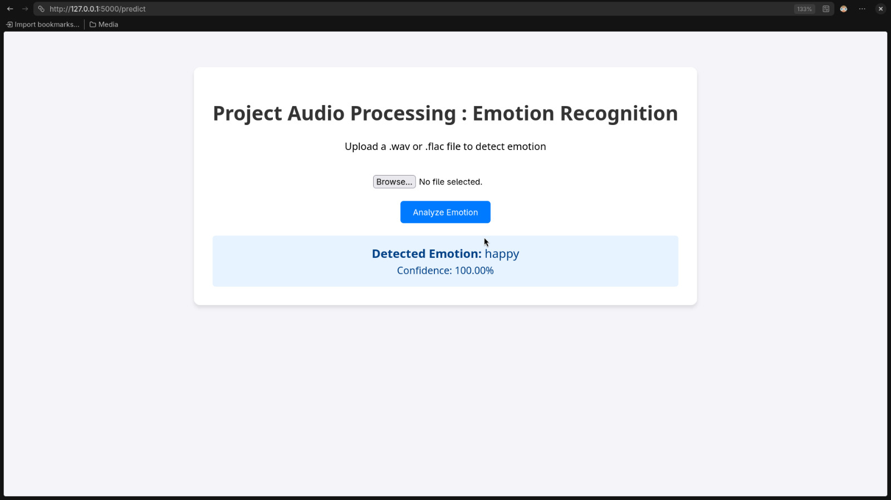
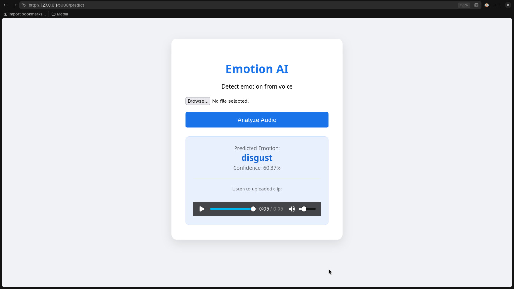

# Audio Emotion Recognition System

## 1. General information

*   **Name of the project:** Emotion Recognition AI
*   **Type of the project:** Learning, Experimentation, and Signal Processing
*   **Main Language(s) of the project:** Python
*   **Goal of this project:** The goal of this project was to explore the intersection of Digital Signal Processing (DSP) and Machine Learning. Specifically, I wanted to understand how raw audio signals can be decomposed into mathematical features (like MFCCs and Pitch) to allow a computer to classify human emotional states from voice recordings.
*   **Scope of this project:** This project encompasses the entire machine learning pipeline: from custom audio preprocessing (normalization, silence removal) and feature engineering (MFCC, Spectral Contrast, RMS), to training both traditional models (SVM with PCA) and Deep Learning architectures (1D-CNN), and finally deploying the model via a Flask-based web interface.
*   **Why:** To move beyond simple text analysis and dive into paralinguistic communication—identifying "how" something is said rather than just "what" is said.
*   **Compatibility:** This project is written in Python 3.x. It requires `librosa` for audio analysis, `PyTorch` for deep learning, `scikit-learn` for traditional ML, and `Flask` for the web UI. It is compatible with Linux, macOS, and Windows.

## 2. Project

This project is a comprehensive toolkit for analyzing vocal emotions. It utilizes two distinct approaches to solve the classification problem:

### Preprocessing & Feature Engineering (`preprocessor.py` & `feature_engineering.py`)
Before any training occurs, raw audio is cleaned. The system performs:
*   **Silence Removal:** Using `librosa.effects.trim` to focus only on voiced segments.
*   **Normalization:** Ensuring consistent amplitude across different recording setups.
*   **Feature Extraction:** I extracted a hybrid vector of features including:
    *   **MFCCs (Mel-frequency cepstral coefficients):** To capture the "texture" of the voice.
    *   **Pitch (YIN algorithm):** To track emotional prosody.
    *   **Spectral Contrast & Zero Crossing Rate:** To distinguish between voiced and unvoiced sounds.

### Deep Learning Architecture (`model.py`)
I implemented a custom **1D Convolutional Neural Network (EmotionCNN)** designed specifically for temporal sequences. 
*   **Conv Layers:** Two convolutional blocks use 1D kernels to scan MFCC sequences for emotional patterns.
*   **Regularization:** Employs Batch Normalization and Dropout (0.3) to prevent overfitting on small datasets.
*   **Adaptive Pooling:** Uses `AdaptiveMaxPool1d` to handle varying lengths of audio input, condensing features into a final classification head.

### Traditional ML Pipeline (`svm_trainer.py`)
As a baseline, I implemented a pipeline using **Support Vector Machines (SVM)**. To handle high-dimensional feature vectors, the pipeline includes:
*   **StandardScaler:** For feature uniformity.
*   **Principal Component Analysis (PCA):** To reduce dimensionality while retaining 95% of variance.
*   **GridSearchCV:** For hyperparameter optimization ($C$, $\gamma$) to ensure the best possible classification boundary.

### Web Interface (Flask Application)
To demonstrate the model's real-world utility, I built a web dashboard. Users can:
*   Upload `.wav` or `.flac` files.
*   Visualize the audio playback.
*   Receive real-time emotion predictions (e.g., "Happy", "Disgust") with a calculated confidence percentage.

*Images* :




## 3. How to run the project

You will need Python 3.8+ and `pip` installed.

1.  **Install dependencies:**
    ```bash
    pip install torch librosa pandas numpy scikit-learn flask tqdm matplotlib
    ```

2.  **Prepare the Dataset:**
    Place your audio files in `data/Audio_Dataset` organized by folders (e.g., `happy/`, `sad/`). Then run the data preparation script to generate CSV manifests:
    ```bash
    python src/data_prep.py
    ```

3.  **Train the CNN Model:**
    To begin the training process and see the progress bars (as seen in the screenshots):
    ```bash
    python src/model.py
    ```
    This will cache features into the `cached/` directory and save the best model weights.

4.  **Launch the Web Interface:**
    Run the Flask server to interact with the model via your browser:
    ```bash
    python app.py
    ```
    Navigate to `http://127.0.0.1:5000` in your web browser to upload and analyze audio clips.
